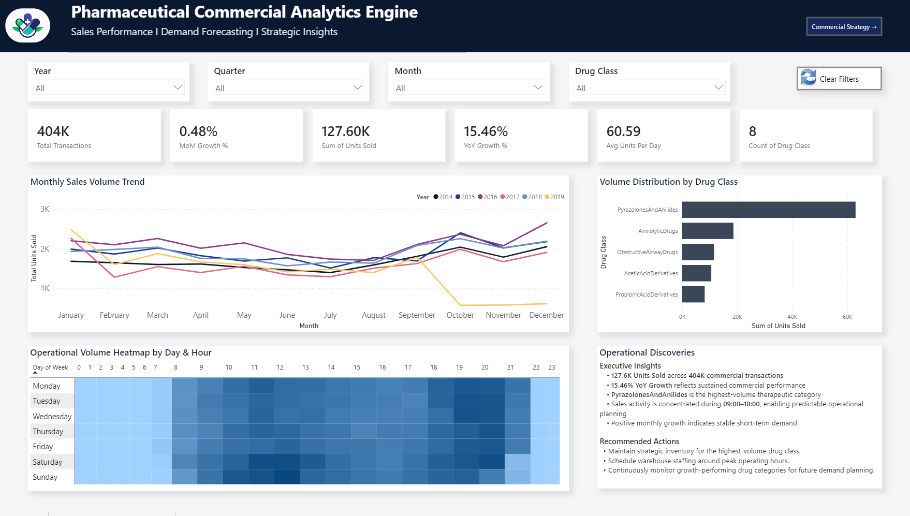
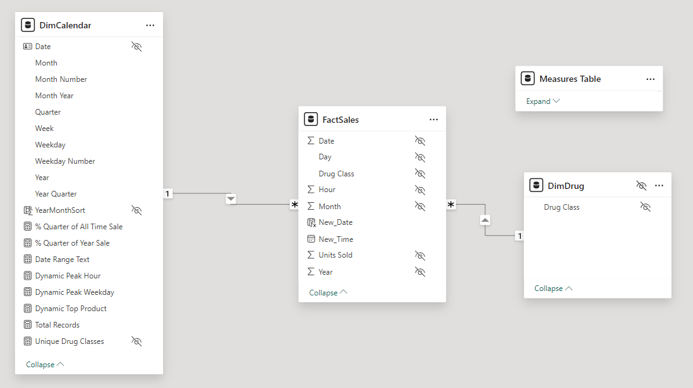
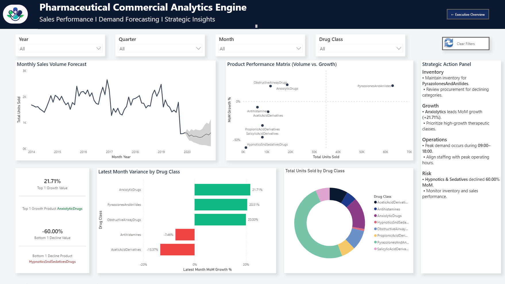

# Pharmaceutical Commercial Analytics Engine



An end-to-end Power BI analytics platform built on 404,000+ pharmaceutical sales transactions. The project covers the full BI lifecycle — locale-broken raw data → cleaned star schema → DAX-driven measures → an interactive executive dashboard — aimed at supporting commercial planning, inventory buffering, and sales-team scheduling decisions.

## Project Overview

Commercial teams need fast answers to questions like:

- Which drug classes drive the most volume, and which are declining?
- Which hours and weekdays see peak transaction activity?
- How does Month-over-Month growth vary by product line?
- Which product tier deserves more marketing/field-rep focus, and which needs a procurement freeze?

The raw source data couldn't answer any of this directly — it arrived as a wide, unpivoted matrix with a regional locale mismatch that broke Power Query's date parsing. This project fixes that and turns it into a governed, measure-driven semantic model.

## Dataset

- **Source file:** `Data/PharmaDrugSales.xlsx`
- **Raw shape:** ~50,500 timestamped rows × 8 drug-class volume columns (wide format)
- **After unpivoting:** ~404,000 transaction-level rows
- **Drug classes (8):** Acetic Acid Derivatives, Propionic Acid Derivatives, Salicylic Acid Derivatives, Pyrazolones and Anilides, Anxiolytic Drugs, Hypnotics & Sedatives, Obstructive Airway Drugs, Antihistamines

## ETL — The Locale Problem

Power Query threw conversion errors across a large share of rows on import. Root cause: the source file was exported under a non-US regional locale, so Power BI misread the datetime values, which broke the date hierarchy and disabled time intelligence entirely.

**Fix applied:**

1. Reset the type-conversion locale to English (United States) before parsing dates/times.
2. Rebuilt clean date parts using `DAY()`, `MONTH()`, `YEAR()`, `TEXT()` instead of trusting the raw string parse.
3. Unpivoted the 8 wide drug-class columns into long format (`Drug Class`, `Units Sold`) to make the data measure-friendly.
4. Cleaned nulls, renamed columns, and staged the result into a proper fact table.

**Result:** zero conversion errors, all ~404K rows loaded, fully reusable pipeline.

## Data Model — Star Schema



```
DimCalendar (1) ──┐
                   ├──(*) FactSales
DimDrug (1) ───────┘
```

| Table | Type | Key | Cardinality |
|---|---|---|---|
| FactSales | Fact | Composite (hidden) | — |
| DimCalendar | Dimension | Date (hidden) | 1 : * → FactSales |
| DimDrug | Dimension | Drug Class (hidden) | 1 : * → FactSales |

All raw numeric/key columns are hidden from report view so every visual is driven by explicit DAX measures rather than implicit aggregation — this avoids silent SUM-vs-AVERAGE mistakes downstream.

## DAX Measures (sample)

```dax
Total Units Sold = SUM(FactSales[Units Sold])

Total Transactions = COUNTROWS(FactSales)

MoM Growth % =
VAR CurrentMonthSales = [Total Units Sold]
VAR PreviousMonthSales =
    CALCULATE([Total Units Sold], DATEADD(DimCalendar[Date], -1, MONTH))
RETURN
    DIVIDE(CurrentMonthSales - PreviousMonthSales, PreviousMonthSales, 0)

Dynamic Top Product =
SELECTCOLUMNS(
    TOPN(1, ALL(FactSales[Drug Class]), CALCULATE(SUM(FactSales[Units Sold]))),
    "Name", FactSales[Drug Class]
)
```

The model contains ~24 measures in total, organized into display folders: Core KPIs, Time Intelligence (MoM/YoY, running totals, previous period), and Dynamic Strategy/Risk (top/bottom performer detection, peak hour/weekday, dynamic tooltip metrics). Full list in [`docs/dax_measures.md`](docs/dax_measures.md).

## Dashboard Pages

### Executive Operations Overview


### Predictive Strategy & Portfolio Performance



The report file (`PowerBI/Pharmaceutical_Commercial_Analytics_Engine.pbix`) contains four pages:

1. **Executive Operations Overview** — KPI cards, monthly sales trend, volume distribution by drug class, and an hour-vs-weekday demand heatmap for staffing decisions.
2. **Predictive Strategy & Portfolio Performance** — MoM/YoY growth comparisons, top/bottom growth products, and inventory-buffer guidance by product tier.
3. **Product Hover Tooltip** — a custom report-page tooltip showing per-product KPIs and a sales trend sparkline on hover.
4. **Drug Detail Deep Dive** — a drill-through page with a detailed transaction table for the selected product.

Slicers for Year/Quarter/Month drive cross-filtering across all pages.

## Key Findings

- Transaction volume peaks between 10:00–18:00, concentrated on Tuesdays and Wednesdays — useful for staffing warehouse and clinic-delivery shifts.
- Pyrazolones hold a stable, dominant baseline share across all quarters — a candidate for flat, year-round inventory buffers rather than seasonal ones.
- Anxiolytics were the fastest-growing category (~+22% MoM at time of analysis) — a candidate for increased marketing/field-rep focus.
- Hypnotics & Sedatives showed a sharp decline (~-60%) — flagged for a distributor-pipeline audit and a procurement freeze to avoid excess stock write-offs.

## Tech Stack

Power BI Desktop · Power Query (M) · DAX · Excel/CSV · Star Schema modeling

## Repo Structure

```text
├── Images/
│   ├── Dashboard_Page1.png
│   ├── Dashboard_Page2.png
│   └── StarSchema.png
├── PowerBI/
│   └── Pharmaceutical_Commercial_Analytics_Engine.pbix
├── Data/
│   └── PharmaDrugSales.xlsx
├── docs/
│   └── dax_measures.md
└── README.md
```

## Notes / Limitations

- This is a portfolio project built on a public/sample pharmaceutical sales dataset; it is not connected to a live or production data source.
- The dataset has no geographic/region field, so this build does not include regional or map-based analysis.
